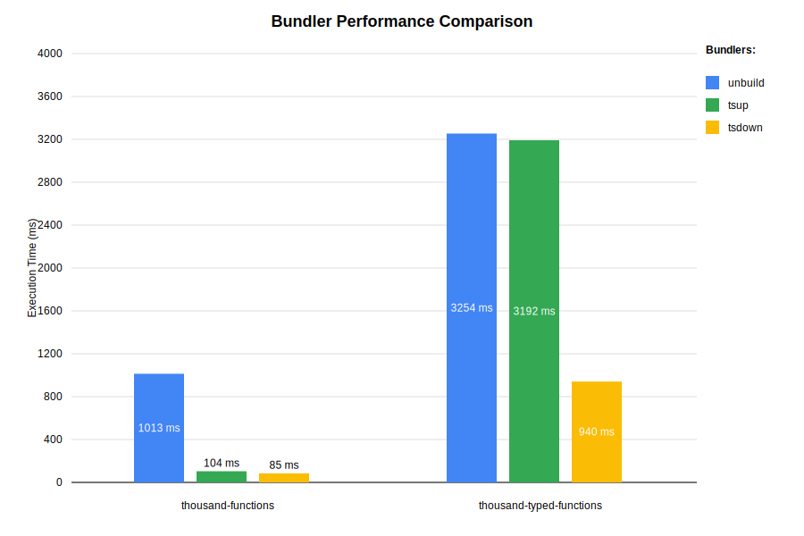

# bundler-benchmark

Benchmark some popular TS bundlers:
- [tsdown](https://tsdown.dev/)
- [tsup](https://tsup.egoist.dev/)
- [unbuild](https://github.com/unjs/unbuild)

Results (benchmarked on MacBook M1 Pro 16GB RAM):




### Development

- Install dependencies
```bash
npm install && npm run build
```
- Generate the benchmark data
```bash
npm run generate
```
- Run the benchmark
```bash
npm run benchmark
```
